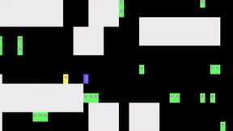

# SaveThePie
SaveThePie is an arcade game developed in C++, for the Linux terminal. This project explores concepts of data structures, object-oriented design and the use of the ncurses library for terminal graphics.

Escape the green enemies and guide the yellow protagonist to the purple π. 
Collect all the π's to move to a new level. 

With each new level, a random map configuration is generated, more π's has to be collected, and enemy speed and quantity is increased. Use bombs (blue boxes) to eliminate close by enemies. Survive while you can.

Game features: randomly generated levels, adjust board size to terminal window, enemies, usable bombs, collect and move items.
