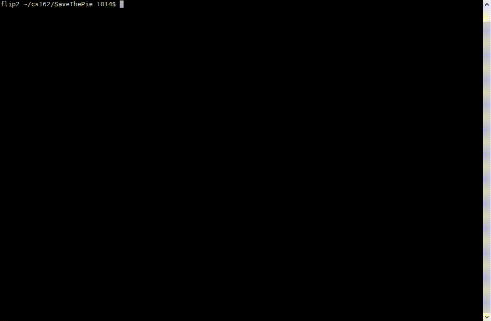

# SaveThePie
SaveThePie an arcade game developed in C++, for the Linux terminal. This project explores concepts of data structures, object-oriented design and the use of the ncurses library for terminal graphics.

Escape the green enemies and guide the yellow protagonist to the purple π

Game features: randomly generated levels, adjust board size to terminal window, escape enemies, kill enemies with bombs, collect and move items.
